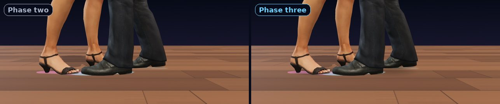
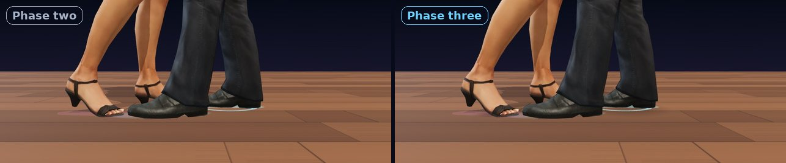
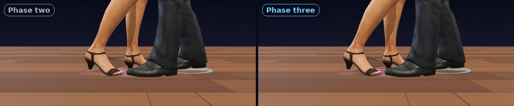
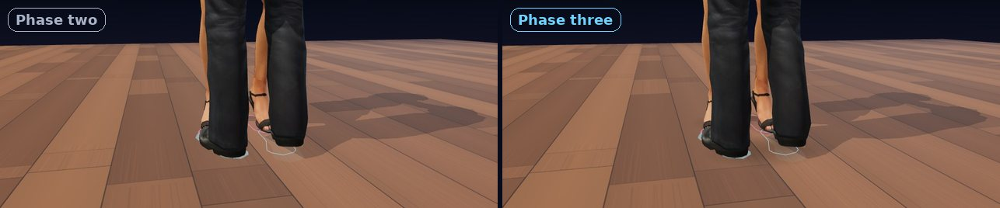
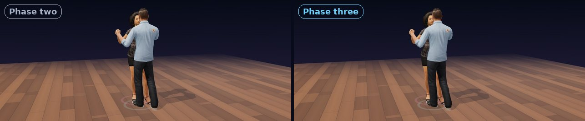
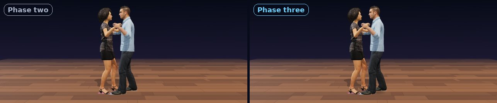
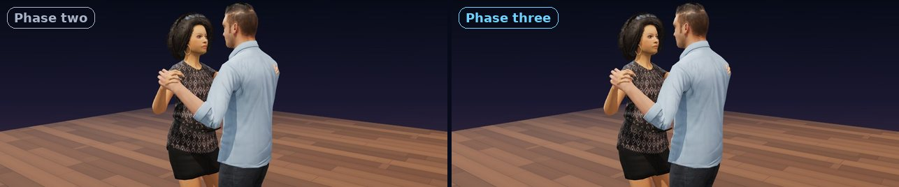
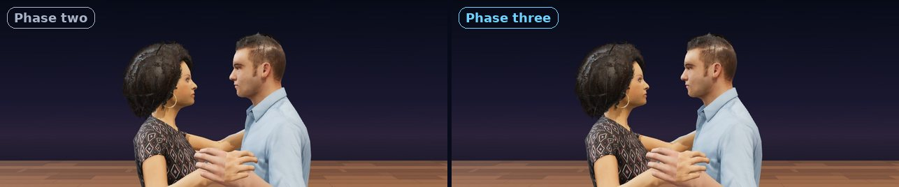
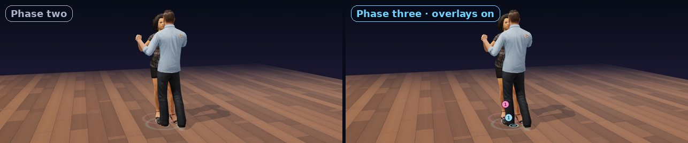

# Phase three: every change, with before and after

Date: 2026-09-26. Base: phase two, `_mission-2026-09-25/salsacoach-dancers/` on the mission branch; the original was not modified.

Each image puts phase two on the left and phase three on the right. Both builds rendered the same frame with the same camera through the `#render` hooks (`qa/compare.mjs`, composed by `tools/pairs.py`). Timing is in beats: 0 = count 1. Everything below the count engine is **generated motion**, not motion capture.

## 0. What did not change

- **The count engine.** In `src/choreo.js`, `beatState()` and its helpers are byte-identical to phase two: `ease`, `windowOff`, `windowLen`, `posFrom`, `slotOf`, `movingFoot`, `ownFoot`, `footXZ`, `bodyXZ`, and the eight step constants. QA hashes them: sha256 `8f1df7be…af99b38` in both versions.
  - A foot stays planted until 0.6 of the beat.
  - It travels with a smoothstep and lands on the count.
  - The weight flips on the landing.
- **The audio clock.** Every pose is still drawn from the time the listener hears (`getOutputTimestamp`). The band synth and the scheduler are unchanged. One callback was added so the count voice can ride the same scheduler.
- **All 33 phase-two checks** run unchanged. Results: `QA_RESULTS.md`.

## 1. Foot plant

| Change | Where |
|---|---|
| **Toe-off.** The toes bend at the ball, so the toe tip stays on the floor until the ball has risen far enough; then the toes follow the foot. Phase two snapped the toes from flat to the foot's angle at 4 mm of lift. Measured: the toe tip never goes below the floor (0 mm), and while the ball is down the toes stay flat (0 mm). | `src/rig.js` |
| **Ankle roll.** A free foot resting on its ball rolls up to 2.9° onto the big-toe side. A swinging foot inverts slightly mid-swing and lands level. The roll pivots on the ball, so a planted ball still moves 0 mm. It never applies to the weighted foot (measured). | `src/choreo.js` (new `roll` target), `src/rig.js` |
| **Contact shadows.** A soft shadow under each shoe is darkest when the foot is flat and carries the weight (opacity 0.62). It shrinks toward the ball as the heel rises and fades as the foot leaves the floor (0.14 in the air). A faint shadow sits under each dancer. | `src/stage.js` (`ContactShadows`) |
| **Free knee.** The unweighted leg's knee points a little in, toward the standing leg; the knees-forward check still passes. | `src/dancer.js` |

## 2. Body (generated, kept small)

| Change | Where |
|---|---|
| **Hip settle** (a Cuban-motion hint). The weight lands on the count; then, during the planted part of the beat, the pelvis settles 1.2 cm further over the standing leg and turns and rolls a little more. It releases while the weight travels to the other foot, and it never happens on a hold or with reduced motion. Measured: the hips stay over the weighted foot through the whole planted part of every count. Phase two only checked at +0.3 beat. | `src/choreo.js` (`settle`), `src/dancer.js` |
| **Torso counter-rotation.** The chest turns slightly against the hips, up to 0.06 rad for the leader and 0.07 rad for the follower. | `src/dancer.js` |
| **Relaxed arms in hold.** The shoulders drop 0.05 rad. The joined hands trail the bodies by 0.05 beat, at most about 3.5 cm. The hands that rest on the partner stay attached. The joined hands stay 10 cm apart, as before. | `src/choreo.js` (`holdTargets` lag), `src/rig.js` |
| **Head and eyes.** The head stays level in avatar space. The Rocketbox eye bones now aim at the partner's eyes, within ±0.3 rad of the head. | `src/rig.js` |
| **Label.** The stage reads "Generated motion, not motion capture" (EN/ES), and the page notes say which parts are generated. | `src/parts/stage-top.html`, `src/parts/notes.html` |

## 3. Teaching overlays (each toggles; EN/ES)

| Change | Where |
|---|---|
| **Count numbers at the landing spots.** From the moment a foot leaves the floor, its landing spot shows the count it lands on. After the landing, the foot keeps its count through the planted part of the beat. Hold counts show in grey. When both dancers show, the farther dancer's numbers sit higher, so they never overlap. Measured: correct on every sample of all three patterns. | `src/overlays.js` (`CountBadges`) |
| **Weight indicator.** A dot on the floor under each pelvis marks the centre of weight, drawn over the legs. The nowbox also says which foot carries the weight. Measured: on the weighted side through every planted phase. | `src/overlays.js` (`WeightDots`), `src/main.js` |
| **Quick-quick-slow.** A caption over the stage shows the four counts of the current group with the current word lit: On1 and Torres read QQS(hold), the 2-3-4 count reads (hold)QQS. The words come from the step table. | `src/rhythm.js`, `src/main.js` |
| **Footprints** (phase two's floor marks) can now be turned off too. | `src/main.js` |
| **Half speed (½×).** The band and the dancers run at half the tempo on the same audio clock (150 → 75 BPM). Measured: each drawn pose equals the heard position, and each new count is drawn on the first frame after it is heard. | `src/main.js` |
| **Step by step.** The → key, Space, the Next button, or a tap on the dancers advances exactly one count. The step is animated over one beat on the audio clock, and a click or the count voice sounds when it lands. With reduced motion it snaps. | `src/main.js` (`stepOnce`) |

## 4. Count voice (new)

- `src/voice.js` is a small Klatt-style formant synthesizer written for this page. It says "one … eight" and "uno … ocho", with no recordings and no third-party voice, so there is nothing to license.
- Each word has an anchor at its stressed vowel. Words are scheduled so the anchor falls exactly on the beat, and compressed to fit a beat at fast tempos.
- Measured in an offline render: every word reaches full level within 41 ms of its beat (EN/ES at 100, 150 and 200 BPM).
- It sounds robotic. It is a placeholder until a recorded human voice with a signed buy-out replaces it.
- The app's own count clips were **not** reused. Its docs say they come from macOS text-to-speech, whose licence covers personal, non-commercial use.

## 5. Practice flow (new page, `practice.html`)

Listen → Find the 1 → Watch slowly → Step along → Speed up. It has no accounts, and nothing is sent anywhere.

- **3D on demand.** No 3D downloads until the visitor taps Start (measured: 0 avatar or texture requests before; 8 after).
- **Find the 1** uses the Count Lab tap judge: ±110 ms is "On the 1", 450 ms is early or late, and "That was the 5" comes within 150 ms of the 5. Measured: identical verdicts to `count-lab/src/app.js` on 10,000 random taps. The counts are hidden while you listen. Three on the 1 in a row finish the step. Calibration stays in memory only.
- **Progress:** five step buttons with `aria-current="step"`, a progress bar, and "Step N of 5". On each step change, focus moves to the step title and a live region announces it.
- **Access:** keyboard throughout (Space and Enter on the tap pad), EN/ES, and reduced motion.
- **Storage:** only the last tempo, in `localStorage`, wrapped in try/catch. Phase two also stored the language; that was removed. The language now comes from `?lang=es` or the browser.
- **Layout:** the stage comes first and the step card beside it (or below it on a phone), so the dancers are on screen while you follow the step.

Screenshots: `evidence/practice-phone-en.jpg`, `evidence/practice-phone-es.jpg`, `evidence/practice-desktop-en.jpg`, `evidence/practice-desktop-es.jpg`.

## 6. Hero option and homepage banner (new)

- **Media:** `media/hero-poster.webp` (22.6 KB), `media/hero-poster.avif` (14.0 KB), and a 3.2 s silent loop, `media/hero-loop.webm` (222 KB) and `media/hero-loop.mp4` (228 KB).
  - All of it is rendered from the real scene through the render hooks (`qa/hero.mjs`, `tools/poster.mjs`).
  - One On1 8-count at 150 BPM, so frame 96 equals frame 0 and the loop has no seam.
- **Component:** `src/banner/`, with `banner.html` (EN), `banner-es.html` (ES), `banner.css` and `banner.js`.
  - The CTA "Try the practice" / "Prueba la práctica" goes to `/practice/` or `/es/practica/`.
  - It has no inline script, so it fits the live CSP.
  - The poster comes first. The loop loads only on screen, never with reduced motion or Save-Data, and has a pause button (WCAG 2.2.2).
  - No 3D on the homepage.
- **Measured** (Lighthouse 12.8.2, mobile, lab, local build, median of 3):
  - Banner test page: LCP 1.05 s (the poster), CLS 0, TBT 0, performance 100, accessibility 100.
  - Homepage copy without / with the banner: LCP 1.72 s / 1.86 s, CLS 0 / 0, 133 KB / 153 KB.
  - Google Fonts cannot load in this container, so both homepage copies ran without web fonts.
- **Staged route:** `dist/site/` holds `practice/` and `es/practica/`, with external `app.js`, plus test pages. Under the live site's policy the avatars' WebAssembly decoder is refused; adding `'wasm-unsafe-eval'` to `script-src` fixes it, and nothing else is needed (measured).

## 7. Performance

Measured on the same machine, interleaving the two builds (`qa/ab.mjs`, `evidence/ab-timing.json`, 2026-09-26 14:09 UTC). Software WebGL, so only the ratios mean anything for a phone.

| | Phase two | Phase three | Ratio |
|---|---|---|---|
| Phone first load, explore page (lite tier; every file sent, fonts excluded) | 1,139,195 B | 1,174,894 B | 1.03× (budget 1.2 MB) |
| Desktop first load (full tier) | 2,180,779 B | 2,216,478 B | |
| Practice page before Start | – | page only, 0 avatar or texture requests | 3D after the visitor's tap |
| Pose, both dancers, desktop (median of 3 × 1000 poses) | 0.054 ms | 0.104 ms | 1.93× |
| Pose, phone emulation | 0.082 ms | 0.088 ms | 1.07× |
| Frame: pose + render + GPU finish, desktop | 1.1 ms | 1.3 ms | 1.18× |
| Frame, phone emulation (pixel ratio capped at 1.5) | 1.9 ms | 1.4 ms | 0.74× |
| Draw calls / triangles | 24 / 21,614 | 38 / 21,950 | +14 draws (shadows, badges, dots) |

Pose time stays far under 1 ms. The frame time is equal within this machine's noise. Real-time frame pacing in headless software WebGL is set by the shared machine, not by the page: a same-time A/B of the two builds gave 299 ms and 299 ms median frame intervals. So the phase-two audio-clock check is sensitive to machine load for both builds (see `QA_RESULTS.md`).

To make room for the new code:
- **Split bundles:** the practice code ships only in the practice bundle.
- **Minified CSS.**
- **Precompiled shaders:** every material, overlays included, compiles at load, and the badge digit textures upload at load, so nothing compiles mid-dance.

## 8. QA and builds

- `qa/qa3.mjs` holds the new checks, which run after the 33 phase-two checks in `qa/qa.mjs`.
- New tools:
  - `qa/engine.mjs`: the engine fingerprint.
  - `qa/ab.mjs`: A/B timing.
  - `qa/hero.mjs`: the banner loop.
  - `qa/demo.mjs`: the demo video.
  - `qa/compare.mjs` and `tools/pairs.py`: before/after images.
  - `tools/poster.mjs`: the poster.
- The build writes the `index`, `phone`, `desktop`, `practice`, `review` and `review-artifact` pages (the review artifact inlines the GLBs as base64), plus `site/`. The page parts moved to `src/parts/`.
